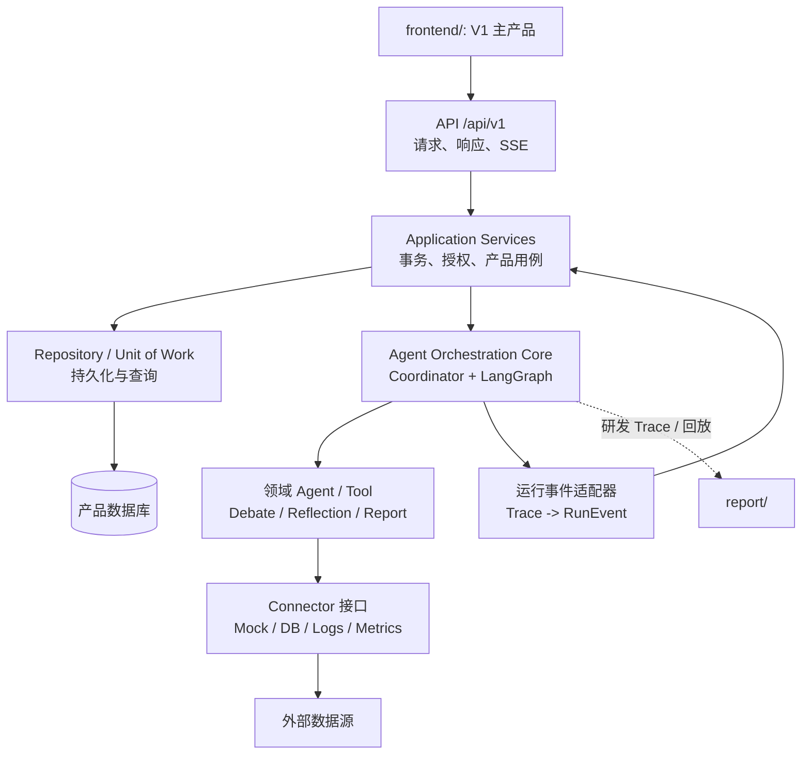
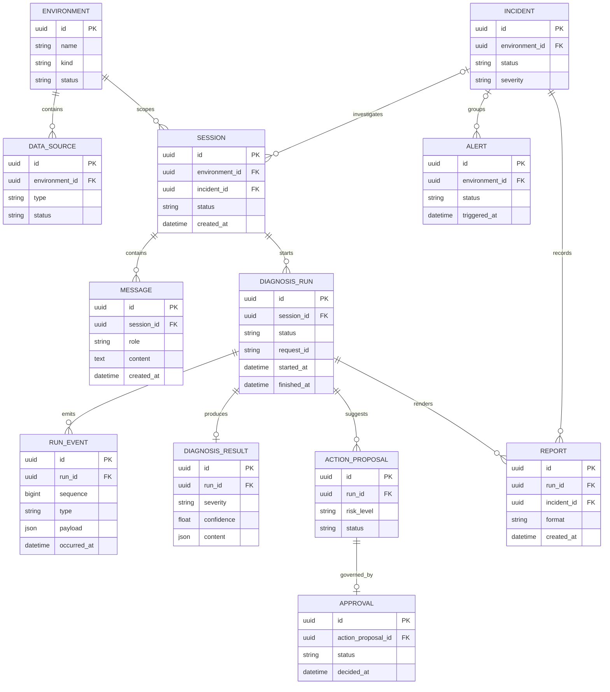
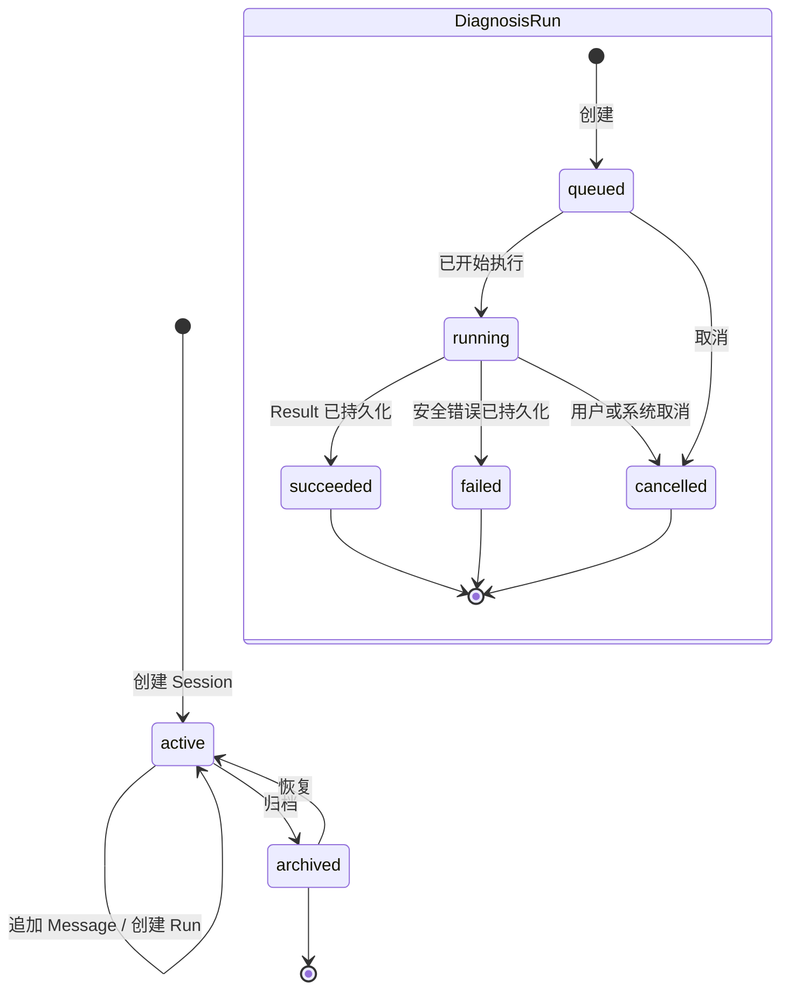
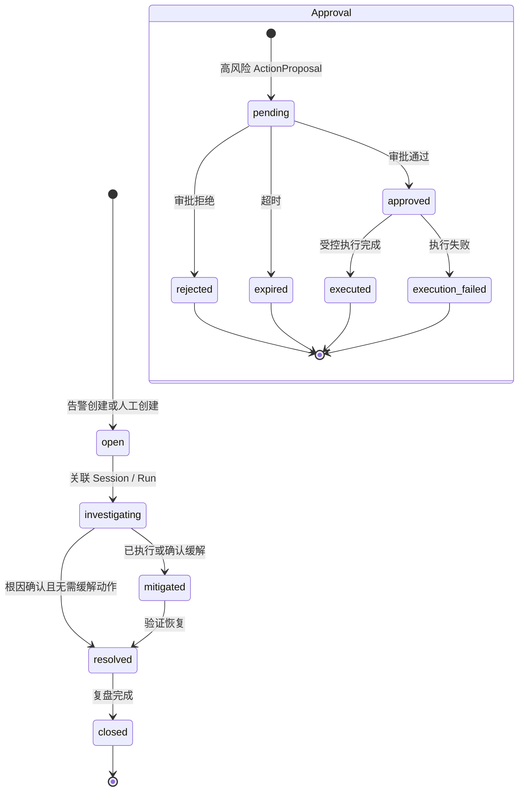

# P0 Step2 — 后端现状与产品架构

> 日期：2026-07-25　|　状态：已完成并提交　|　基线提交：`4047f14 docs: 同步P0产品化基线文档`

## Design

P0.2 不实现数据库、会话或新 API，而是回答四个后续实现必须先回答的问题：现有 Agent Core 到底有哪些可复用能力；哪些当前状态不适合作为产品状态；V1 的事务边界应该落在哪里；P1/P2 应以什么顺序渐进迁移，避免一次性搬动 `backend/src`。

审计范围仅限已跟踪的 `backend/`、根 `data/` 和 `config/`。用户未跟踪的 `frontend/` 与 `report/` 不读取、不修改、不暂存。

## Step

1. 核对 FastAPI、Pydantic、SSE 和测试契约。
2. 审计 Coordinator/LangGraph、Agent/Tool、Debate/Reflection、记忆和审批的状态与副作用。
3. 审计 mock/真实数据源、评测契约和当前并发边界。
4. 输出现状差距、产品分层、渐进目录、实体关系和状态机。
5. 将架构决策限制在 P0；精确 API 字段留给 P0.3，持久化实现留给 P1/P2。

## 当前现状

### 已可复用的能力

| 现有能力 | 代码锚点 | V1 角色 | 处理原则 |
|---|---|---|---|
| HTTP 校验、统一错误体、健康检查 | `backend/src/app.py:43`、`backend/src/api/schemas.py:19` | API 基础约定 | 保留语义，P1 迁移到 `/api/v1` 路由与统一依赖 |
| 受控 Trace 事件和 SSE 序列化 | `backend/src/api/events.py:10`、`backend/src/core/coordinator.py:134` | RunEvent 实时投递来源 | 保留事件语义，P2 增加 `run_id`、事件 ID、持久化和断线恢复 |
| direct/chain/parallel 编排 | `backend/src/core/graph.py:99` | Agent Orchestration Core | 保留并从产品事务中隔离 |
| 领域 Agent、ToolRegistry、mock fallback | `backend/src/agents/`、`backend/src/tools/` | 诊断执行能力 | 保留；P4 以连接器接口逐项扩展真实数据源 |
| Debate、Reflection、报告生成 | `backend/src/core/debate.py:10`、`backend/src/core/reflection.py:10`、`backend/src/agents/report_agent.py:7` | 质量与生成能力 | 保留内部流程；P2 将输出适配为结构化结果 |
| 评测、固定条件、场景与 mock | `backend/src/eval/`、`backend/src/core/experiment.py:10`、`data/scenarios.py:15` | 回归与演示基线 | 与产品运行时分离，继续保持确定性 |

### 当前产品化缺口

| 主题 | 当前事实 | V1 目标 | 首个落点 |
|---|---|---|---|
| 会话 | `BaseAgent` 仅在进程内保留短期消息；没有产品 Session | 可恢复、可追问、可审计的 `Session` / `Message` | P1 模型与 Repository，P2 切片接入 |
| 运行 | `CoordinatorAgent.route()` 一次性返回 Markdown；`route_stream()` 即时 yield | 可追踪的 `DiagnosisRun`，状态、输入、输出、耗时可持久化 | P2 |
| 事件 | Trace 仅保存为 Coordinator 最近一次内存字段；SSE 无 event ID | 有序、可重放的 `RunEvent`，支持 `Last-Event-ID` 或游标恢复 | P2/P0.3 |
| 结果 | `DiagnoseResponse.result` 与 `ReportAgent.generate()` 为 Markdown | `DiagnosisResult` 的根因、证据、影响、建议、风险、审批等结构化字段 | P0.3 契约，P2 适配 |
| 证据 | Tool/Agent 主要返回 `str`，图状态使用裸 `dict` | 可引用、可定位、可脱敏的结构化 Evidence | P0.3 定义，P2 先做适配层 |
| 并发 | `CoordinatorAgent`、Agent 短期记忆、最近 trace 与 `data.scenarios` 激活场景均含进程级可变状态 | 每次 Run 独立上下文，产品请求不共享可变诊断状态 | P1/P2；在此之前产品 API 不并发复用单例 |
| 审批 | `request_approval()` 使用阻塞 `input()`，`ApprovalRequired` 未进入 API 流 | `ActionProposal` / `Approval` 持久化状态机和异步审批 | P5，P2 仅返回 `requires_approval` |
| 记忆 | `data/memory.json` 本地文件读写，无租户、会话或审计边界 | 可审计 `MemoryRecord` 与知识治理 | P4；P2 默认不把它作为会话事实来源 |
| 数据源 | DB/Log 多为 mock；Server 可读 psutil；无连接配置持久化 | `Environment` / `DataSource`、健康检查、只读连接器和 mock fallback | P4 |
| 报告 | Markdown 直接生成，无版本、归档或导出记录 | `Report` 与 Run/Incident 关联，可导出、搜索、归档 | P6 |
| 启动与配置路径 | 代码从 `backend/src` 导入根 `data/`，但 `load_config()` 只查 `backend/config`，实际模板在根 `config/`；脚本实际位于 `backend/scripts/` | 单一 Settings / 路径解析策略，开发、测试、容器环境一致 | P1 前修复，当前以显式 `PYTHONPATH` 迁移命令运行 |

## 产品分层与调用方向



### 边界决策

| 层 | 负责 | 禁止承担 |
|---|---|---|
| API | 协议、鉴权依赖、输入校验、HTTP/SSE 转换 | 直接编排 Agent、直接操作 ORM 细节、拼业务 Markdown |
| Application | Session/Run/Incident 用例、事务、状态迁移、审计、向 Agent 传入一次性执行上下文 | LangGraph 节点实现、SQL/日志解析、前端展示逻辑 |
| Domain | 实体、不变量、状态枚举、值对象、授权规则 | FastAPI、OpenAI、SQLAlchemy Session、外部 SDK |
| Infrastructure | ORM、Repository、Migration、连接器、对象存储、通知实现 | 领域决策与路由策略 |
| Agent Core | 诊断路由、Agent 协作、Debate、Reflection、内部 Trace | 产品会话生命周期、用户权限、持久化事务 |
| Tools/Connectors | 只读诊断采集、结构化证据和确定性 mock fallback | DDL/DML、未审批高危执行、产品状态变更 |

## 渐进目录方案

不移动既有 Agent Core。P1/P2 只新增产品层，旧接口先作为兼容入口保留，切片稳定后再决定是否迁移：

```text
backend/src/
├── api/                    # 保留当前契约；新增 v1/ 路由、schemas、SSE 适配
├── application/            # P1：session_service、diagnosis_service、run_event_service
├── domain/                 # P1：entities、enums、value_objects、ports
├── infrastructure/         # P1：db、repositories、connectors、settings
├── agents/                 # 保留
├── core/                   # 保留 Coordinator、Graph、质量机制；逐步接收 RunContext
├── tools/                  # 保留；P4 逐步改为 Connector 驱动
├── memory/                 # 保留旧文件记忆；P4 再迁移产品记忆
└── app.py                  # 组合根；P1 后挂载 /api/v1
```

兼容规则：P1/P2 不删除 `/diagnose`、`/diagnose/stream` 或 `report/` 的历史依赖；新产品流程只从 `/api/v1` 进入。旧 API 无状态语义不被伪装成持久化 API。

## 核心实体关系

下图是 P1/P2 需要落地的最小产品关系，不代表本 Step 已创建表或 ORM：



关系取舍：`DiagnosisResult` 是每次 Run 的最终事实，不直接挂在 Session；Session 承载对话连续性，Incident 承载处置生命周期。`RunEvent.sequence` 是持久化事件顺序，不能依赖 SSE 连接顺序。敏感 DataSource 凭据不放在业务实体 JSON 中，只保存受控引用或密钥标识。

## 状态机

### Session 与 Run



约束：只允许 `queued` / `running` 的 Run 追加 `RunEvent`；`succeeded` 必须有一个 `DiagnosisResult`；`failed` 必须有安全错误码而非内部异常；同一 Session 可以顺序拥有多个 Run。

### Incident 与 Approval



约束：P2 只允许诊断结果标记 `requires_approval` 并创建建议草稿；不得从 ToolRegistry 调用阻塞 `input()`。实际 Approval 状态迁移、执行与审计在 P5 落地。

## 迁移顺序与风险控制

1. **P0.3**：把产品模型映射为 API 契约，先定义 `DiagnosisResult`、Run 状态、错误体和事件信封，不改 Agent Core。
2. **P1**：引入 SQLAlchemy 2、Alembic、SQLite 本地开发与 PostgreSQL 兼容，先实现 Domain、Repository、Unit of Work 和 Migration；不迁移 Agent Graph。
3. **P2**：由 `DiagnosisService` 创建并持久化 Run，向一次性 Coordinator 执行上下文转发；将 Trace 适配为 RunEvent，完成后写入结构化结果和 Markdown 展示补充。
4. **P3**：主前端只消费 Session/Run/Result 契约，完整 Trace 通过受控跳转进入 `report/`。
5. **P4/P5/P6**：分别接入真实数据源与知识、审批/事件、报告/导出；不提前伪造已实现能力。

当前风险：`CoordinatorAgent` 的最近 trace、Agent 的短期记忆和 `data.scenarios` 的激活场景为可变状态，P2 必须避免 API 单例并发共享。`LongTermMemory` 的 `data/memory.json` 不可作为产品真相源；评测继续显式关闭长期记忆。`.venv\Scripts\python.exe` 指向已移除的 Python 解释器，P0.2 为文档盘点未运行测试；P1 前必须修复或重建可用运行环境。

目录迁移风险：`backend/src/config.py:22` 以源码目录上级推导配置目录，实际解析 `backend/config/`，而仓库模板位于根 `config/`；同时 Agent/Tool 运行时需要根 `data/`。在 P1 建立 Settings 前，启动命令必须从仓库根执行并显式设置 `PYTHONPATH=$PWD\\backend;$PWD`。这只是迁移期约定，不应成为长期产品运行时机制。

## Test

- 只读审计了 `backend/src/app.py`、`backend/src/api/`、`backend/src/core/`、`backend/src/agents/`、`backend/src/tools/`、`backend/src/memory/`、`backend/src/eval/` 和 `backend/tests/`。
- 审计确认 API 测试覆盖同步诊断、SSE、统一校验错误和安全流式失败：`backend/tests/test_api.py:67`。
- 未运行 Python 测试：根目录 `.venv\Scripts\python.exe --version` 无法启动，报错指向不存在的 Python 3.11 路径。未修改环境或依赖以绕过该问题。

## Review

- 已完成独立审查，详见 `docs/开发/P0-V1产品化基线/review.md` 的 P0.2 小节。
- 审查确认现状结论均有代码锚点，分层方案不要求一次性重构，ER 图和状态机与阶段二计划一致，且本 Step 未触碰 `frontend/`、`report/` 或业务代码。
- 结论：通过；发现的配置/数据路径与 Python 解释器风险已作为 P1 前置约束记录，不阻塞本次文档基线提交。
